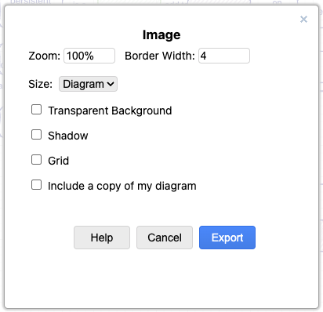

# Concept Maps

Mental models prepared for lessons taught by the Global Health Engineering group.

All material made available under the [Creative Commons - Attribution license](LICENSE.md).

-   [Concept Maps](#concept-maps)
    - [research data management workflow](#research-data-management-workflow)

## Concept Maps

### research data management workflow

## Contributing

### Formatting

-   All diagrams are created with diagrams.net,
    which can be [used online](https://app.diagrams.net/)
    or [downloaded](https://github.com/jgraph/drawio-desktop/releases/tag/v13.6.2)
    from [the project's GitHub repository](https://github.com/jgraph/drawio)
    (approximately 100MB).

-   Save all diagrams as "Editable SVG"
    (a superset of the SVG standard that includes information about anchor points and connections).

-   Use the "Sketch" style,
    which can be chosen from the "Style" menu when no elements are selected.
    (See [this blog post](https://www.diagrams.net/blog/rough-style) for details.)

-   Use #FEFEFF (very pale blue) as a background color
    and #000080 (very dark blue) for lines and text.
    Use 1pt lines, no fill, and 12pt Helvetica.
    If there is a central concept,
    give it a 3pt outline
    and make the text bold and italic

-   Connect both ends of lines to anchor points on concepts
    and move text as needed so that it does *not* lie on the line.

-   When mentioning specific functions, do _not_ put `()` after the function's name
    (as this makes it impossible to distinguish between a mention of the function
    and a call to the function with zero arguments).

### Exporting

-   Export PNG by selecting everything and then using these settings:
    -   Zoom: 100%
    -   Border Width: 4 pixels
    -   Selection Only
        -   Crop

-   Do *not* select "Transparent Background", "Shadow", "Embed Images",
    or "Include a copy of my diagram".

### Discussion

-   **Why concept maps?**
    They help authors figure out what they want to teach,
    give other instructors a quick overview of a lesson,
    and allow learners to check that they have constructed the right mental model.

-   **What about translations?**
    We hope eventually to be able to store translated text in the `.drawio` files.
    For now,
    please copy an existing diagram and save it in the appropriate language directory
    (e.g., `af/topic.svg` for concept maps in Afar).

-   **Why SVG?**
    Because vector diagrams rescale much more smoothly than raster images.

-   **Why not use color? Or more shapes? Or...?**
    The simpler these diagrams are,
    the easier they will be to maintain.
    Simple diagrams also display better on smaller or older devices.

-   **Why not use [Graphviz](https://graphviz.org/),
    [DiagrammeR](https://rich-iannone.github.io/DiagrammeR/),
    or some other tool that compiles text into diagrams?**
    1.  As [these graphviz-generated files](./dot/README.md) show,
        it's hard to get their automatic layout algorithms
        to do as good a job as a person can do.
    2.  They have a much steeper learning curve,
        which means fewer people will be able to contribute.
    3.  They don't actually make version control easier
        (reading and understanding the textual description of a diagram
        is as hard as viewing two diagrams side by side).

## Attribution

The content and structure of this README.md is taken from [rstudio/concept-maps](https://github.com/rstudio/concept-maps) Copyright (c) RStudio licenses as [CC-BY-40](http://creativecommons.org/licenses/by/4.0/).
